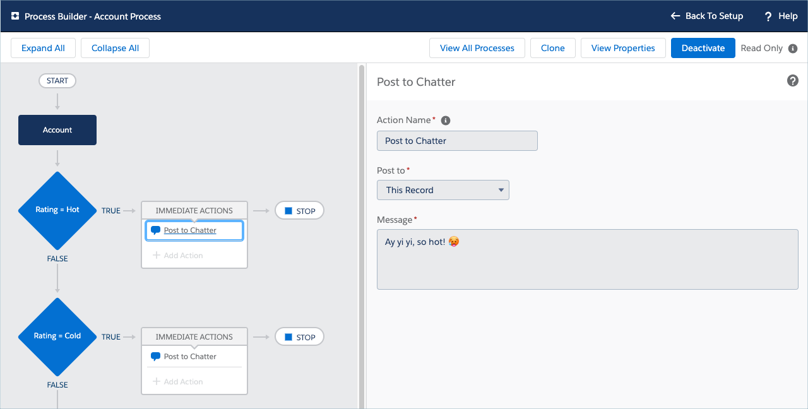
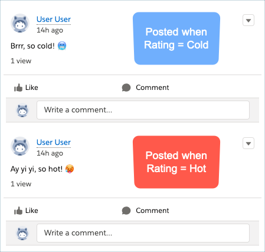
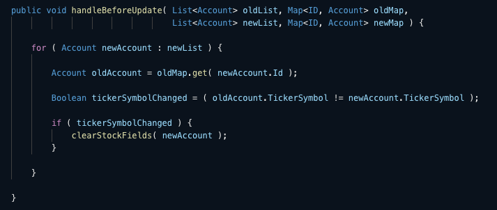
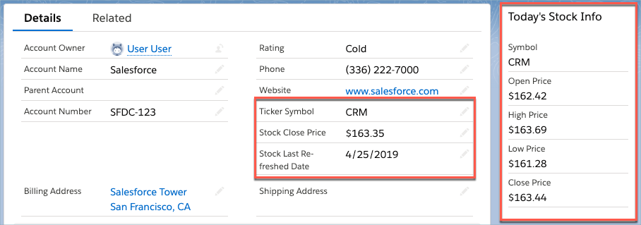

# Testing on the Salesforce Platform

* [Overview](#overview)
* [The App](#the-app)
* [The Tests](#the-tests)
* [Resources](#resources)

## Overview

This is the sample app used to demo [unit](http://softwaretestingfundamentals.com/unit-testing/), [integration](http://softwaretestingfundamentals.com/integration-testing/), and [system](http://softwaretestingfundamentals.com/system-testing/) testing at the [Nashville Salesforce Developer Group meetup on April 25, 2019](https://trailblazercommunitygroups.com/events/details/salesforce-nashville-tn-developers-group-presents-april-19-developer-user-group/).

The purpose of the app is in the tests, which show a progression of unit tests focused on particular Apex methods, to larger integration tests of the side effects of processes and triggers to DML updates, to system testing everything together in a live Salesforce [sandbox or scratch org](https://www.youtube.com/watch?v=fiRKUkLF6Eg).

Since Apex unit testing and Lightning Web Component unit testing have to mock callouts, they don't give a great picture of how well all the pieces come together in a live environment. The last part of the presentation covered system testing using [Ghost Inspector](https://ghostinspector.com/) to automate a browser to log in to a scratch org, create an account, then assert the behavior of the [FinanceStockInfo](https://github.com/douglascayers/nashvillesfdc-testing-on-the-platform/tree/master/force-app/main/default/lwc/financeStockInfo) component that calls out to a finance web service to retrieve stock prices from [AlphaVantage](https://www.alphavantage.co/documentation/#daily).

## The App

This app includes a Process and Trigger on the Account record, and a Lightning Web Component on the Account record page.

When the account's rating becomes "Hot" or "Cold", then the process posts a message to Chatter.

When the account's ticker symbol changes, then the trigger resets the stock last refreshed date and stock close price.

When viewing the account record, the Lightning record page includes a stock price component in the top-right to display the day's prices for the account's ticker symbol.

## The Tests

* [AccountTriggerHandlerTest.cls](https://github.com/douglascayers/nashvillesfdc-testing-on-the-platform/blob/master/force-app/main/default/classes/AccountTriggerHandlerTest.cls)
  - Includes three tests, a unit test that asserts behavior of a specific method, and then two methods that assert behavior of the account trigger and account process when DML operations occur.

* [FinanceServiceTest.cls](https://github.com/douglascayers/nashvillesfdc-testing-on-the-platform/blob/master/force-app/main/default/classes/FinanceServiceTest.cls)
  - Includes two tests, a unit test that asserts a successful and unsuccessful call to the finance web service.
  - As a unit test, the actual callout is [mocked](https://github.com/douglascayers/nashvillesfdc-testing-on-the-platform/blob/master/force-app/main/default/classes/FinanceServiceHttpCalloutMock.cls), so these unit tests only assert that our code conforms to a certain interface contract. We have to wait til system testing to be validate our assumptions of the API's behavior.
  
* [FinanceControllerTest.cls](https://github.com/douglascayers/nashvillesfdc-testing-on-the-platform/blob/master/force-app/main/default/classes/FinanceControllerTest.cls)
  - Includes two tests, which are short and sweet that cover the small functionality the controller provides beyond the finance service.
  - The controller is used by the Lightning web component.
  
* [financeStockInfo.test.js](https://github.com/douglascayers/nashvillesfdc-testing-on-the-platform/tree/master/force-app/main/default/lwc/financeStockInfo/__tests__)
  - Includes two tests, which assert that the component displays stock info when given a ticker symbol, or doesn't render when there is no ticker symbol.
  - As a unit test, the actual callout is [mocked](https://github.com/douglascayers/nashvillesfdc-testing-on-the-platform/blob/master/force-app/main/default/lwc/financeStockInfo/__tests__/financeStockInfo.test.js#L13), so these unit tests only assert that our code conforms to a certain interface contract. We have to wait til system testing to be validate our assumptions of the API's behavior.

## Resources

* [Unit Testing on the Lightning Platform](https://trailhead.salesforce.com/en/content/learn/modules/unit-testing-on-the-lightning-platform)
* [Apex Testing](https://trailhead.salesforce.com/en/content/learn/modules/apex_testing)
* [Flow Testing and Distribution](https://trailhead.salesforce.com/en/content/learn/modules/flow-testing-and-distribution)
* [Testing Aura and LWC in a Single Test](https://www.wissel.net/blog/2019/03/testing-aura-and-lwc-in-a-single-test.html)
* [Testing Lightning Web Components](https://developer.salesforce.com/docs/component-library/documentation/lwc/lwc.testing)
* [Unit Testing Lightning Web Components with Jest](https://developer.salesforce.com/blogs/2019/03/unit-test-lightning-web-components-with-jest.html)
